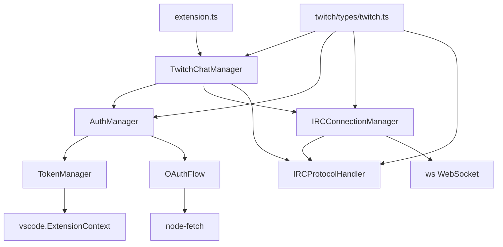

# Codebase Map & Function Index

This document provides a comprehensive map of the codebase with function signatures, dependencies, and relationships.

## 📁 Directory Structure

```
vscode-twitch-chatroom/
├── src/                          # Source code
│   ├── extension.ts              # Extension entry point
│   ├── commands/                 # Legacy command system
│   ├── types/                    # Shared type definitions
│   └── twitch/                   # Twitch integration
│       ├── auth/                 # Authentication system
│       ├── irc/                  # IRC connection system
│       ├── types/                # Twitch-specific types
│       └── twitchChatManager.ts  # Main chat manager
├── docs/                         # Documentation
├── out/                          # Compiled JavaScript
├── test/                         # Test files (future)
└── .vscode/                      # VSCode configuration
```

## 🔍 Function Inventory by File

### 🚀 Extension Entry Point

#### `src/extension.ts`
**Purpose**: VSCode extension activation and command registration

```typescript
// Main functions
export function activate(context: vscode.ExtensionContext): void
export function deactivate(): void

// Command handlers (registered)
async () => Promise<void>  // twitchChatroom.connect handler
async () => Promise<void>  // twitchChatroom.disconnect handler  
async () => Promise<void>  // twitchChatroom.sendMessage handler
async () => Promise<void>  // twitchChatroom.logout handler
() => void                 // twitchChatroom.helloWorld handler
```

**Dependencies**: TwitchChatManager, vscode API  
**Exports**: activate, deactivate  
**Key Operations**: Command registration, TwitchChatManager initialization

---

### 🔐 Authentication System

#### `src/twitch/auth/authManager.ts`
**Purpose**: Main authentication coordinator

```typescript
class AuthManager {
  constructor(context: vscode.ExtensionContext)
  
  // Core authentication methods
  async authenticate(): Promise<AuthResult>
  isAuthenticated(): boolean
  getAccessToken(): string | null
  async refreshToken(): Promise<void>
  async logout(): Promise<void>
  
  // Configuration management
  validateConfig(): { isValid: boolean; missingFields: string[] }
  updateConfig(config: Partial<TwitchConfig>): void
  getTokenInfo(): { username?: string; scopes?: string[]; expiresAt?: Date } | null
  
  // Private methods
  private getConfigFromSettings(): TwitchConfig
}
```

**Dependencies**: TokenManager, OAuthFlow, vscode.workspace  
**Key State**: tokenManager, oauthFlow, config  
**Integration**: VSCode configuration, SecretStorage

#### `src/twitch/auth/tokenManager.ts`
**Purpose**: Secure token storage using VSCode SecretStorage

```typescript
class TokenManager {
  constructor(private context: vscode.ExtensionContext)
  
  // Token storage operations
  async storeTokens(tokens: TokenData): Promise<void>
  async getStoredTokens(): Promise<TokenData | null>
  async clearTokens(): Promise<void>
  
  // Token validation
  isTokenExpired(): boolean
  hasValidToken(): boolean
  
  // Token access
  getAccessToken(): string | null
  getRefreshToken(): string | null
  getTokenInfo(): { username?: string; scopes?: string[]; expiresAt?: Date } | null
}

// Constants
static readonly TOKEN_KEY = 'twitchTokenData'
```

**Dependencies**: vscode.ExtensionContext.secrets  
**Security**: VSCode SecretStorage API, 5-minute expiration buffer  
**Data**: Encrypted TokenData storage

#### `src/twitch/auth/oauthFlow.ts`
**Purpose**: OAuth 2.0 Authorization Code Flow implementation

```typescript
class OAuthFlow {
  constructor(private config: TwitchConfig)
  
  // OAuth flow methods
  async startFlow(): Promise<AuthResult>
  async exchangeCodeForTokens(code: string): Promise<TokenData>
  async refreshAccessToken(refreshToken: string): Promise<TokenData>
  async validateToken(accessToken: string): Promise<boolean>
  
  // Private utility methods
  private buildAuthUrl(state: string): string
  private generateState(): string
}

// OAuth endpoints (static)
static readonly TWITCH_AUTH_URL = 'https://id.twitch.tv/oauth2/authorize'
static readonly TWITCH_TOKEN_URL = 'https://id.twitch.tv/oauth2/token'  
static readonly TWITCH_VALIDATE_URL = 'https://id.twitch.tv/oauth2/validate'
```

**Dependencies**: node-fetch, vscode.env.openExternal  
**Security**: CSRF protection with state parameter  
**Network**: HTTP requests to Twitch OAuth API

---

### 💬 IRC Connection System

#### `src/twitch/irc/connectionManager.ts`
**Purpose**: WebSocket connection management with auto-reconnection

```typescript
class IRCConnectionManager {
  constructor()
  
  // Connection management
  async connect(token: string, username: string): Promise<void>
  disconnect(): void
  
  // Channel operations
  async joinChannel(channel: string): Promise<void>
  async leaveChannel(channel: string): Promise<void>
  
  // Messaging
  sendMessage(channel: string, message: string): void
  
  // State queries
  getConnectionState(): ConnectionState
  getJoinedChannels(): string[]
  isConnected(): boolean
  
  // Event registration
  onMessage(handler: (message: IRCMessage) => void): void
  onStateChange(handler: (state: ConnectionState) => void): void
  onError(handler: (error: Error) => void): void
  
  // Private methods
  private setupWebSocketHandlers(): void
  private handleConnectionOpen(): Promise<void>
  private handleMessage(data: string): void
  private processIRCMessage(message: IRCMessage): void
  private handleConnectionClose(code: number, reason: string): void
  private handleConnectionError(error: Error): void
  private attemptReconnect(): void
  private startHeartbeat(): void
  private sendRawMessage(message: string): void
  private setConnectionState(state: ConnectionState): void
  private clearTimers(): void
}

// Configuration constants
static readonly IRC_WEBSOCKET_URL = 'wss://irc-ws.chat.twitch.tv:443'
static readonly PING_INTERVAL = 5 * 60 * 1000  // 5 minutes
static readonly RECONNECT_DELAY = 5000         // 5 seconds
```

**Dependencies**: ws (WebSocket), IRCProtocolHandler  
**Features**: Exponential backoff, heartbeat, state management  
**Events**: Message, state change, error handling

#### `src/twitch/irc/ircProtocol.ts`
**Purpose**: IRC message parsing and protocol handling

```typescript
class IRCProtocolHandler {
  // Message parsing
  parseMessage(rawMessage: string): IRCMessage
  parsePrivMsg(ircMessage: IRCMessage): ChatMessage | null
  
  // Message formatting
  formatAuthMessage(token: string, username: string): string
  formatCapabilityRequest(): string
  formatJoinMessage(channel: string): string
  formatPartMessage(channel: string): string
  formatPrivMsg(channel: string, message: string): string
  formatPongMessage(server: string): string
  
  // Message type detection
  isCapabilityMessage(ircMessage: IRCMessage): boolean
  isPingMessage(ircMessage: IRCMessage): boolean
  isJoinMessage(ircMessage: IRCMessage): boolean
  isPartMessage(ircMessage: IRCMessage): boolean
  isPrivateMessage(ircMessage: IRCMessage): boolean
  
  // Private parsing helpers
  private parseTags(tagsString: string): Record<string, string>
  private parseBadges(badgesString?: string): Badge[]
  private parseEmotes(emotesString?: string, messageText?: string): Emote[]
  private parseUserType(tags: Record<string, string>): UserType
  private extractUsernameFromPrefix(prefix?: string): string | null
  private generateMessageId(): string
}

// IRC capabilities
static readonly IRC_CAPABILITIES = [
  'twitch.tv/commands',
  'twitch.tv/membership', 
  'twitch.tv/tags'
]
```

**Dependencies**: None (pure parsing logic)  
**Features**: Twitch-specific IRC parsing, emote handling, badge parsing  
**Protocol**: CRLF message separation, tag parsing

---

### 🎮 Main Chat Manager

#### `src/twitch/twitchChatManager.ts`
**Purpose**: High-level chat operations and VSCode integration

```typescript
class TwitchChatManager {
  constructor(private context: vscode.ExtensionContext)
  
  // Authentication operations
  async authenticate(): Promise<boolean>
  async logout(): Promise<void>
  isAuthenticated(): boolean
  
  // Connection operations
  async connectToChannel(channel: string): Promise<boolean>
  async disconnect(): Promise<void>
  isConnected(): boolean
  
  // Messaging operations
  async sendMessage(message: string): Promise<boolean>
  
  // State queries
  getCurrentChannel(): string
  getConnectionState(): ConnectionState
  
  // Event registration
  onChatMessage(handler: (message: ChatMessage) => void): void
  onConnectionStateChange(handler: (state: ConnectionState) => void): void
  
  // Lifecycle
  dispose(): void
  
  // Private methods
  private setupStatusBar(): void
  private updateStatusBar(): void
  private setupConnectionHandlers(): void
  private handleIRCMessage(ircMessage: IRCMessage): void
  private emitChatMessage(message: ChatMessage): void
}
```

**Dependencies**: AuthManager, IRCConnectionManager, IRCProtocolHandler  
**Integration**: VSCode status bar, error messages, configuration  
**Events**: Chat messages, connection state changes

---

### 📝 Type Definitions

#### `src/twitch/types/twitch.ts`
**Purpose**: Twitch-specific TypeScript interfaces

```typescript
// Configuration
interface TwitchConfig
interface TokenData
interface AuthResult

// IRC and Chat
interface IRCMessage
interface ChatMessage
interface UserAction
interface TwitchChannelInfo

// User and Content
interface Badge
interface Emote
interface EmotePosition

// Enums
enum UserType { VIEWER, SUBSCRIBER, MODERATOR, VIP, BROADCASTER }
enum ConnectionState { DISCONNECTED, CONNECTING, AUTHENTICATING, CONNECTED, ERROR, RECONNECTING }
```

**Usage**: Type safety across all Twitch-related code  
**Export**: All interfaces and enums for external use

#### `src/types/extension.ts`
**Purpose**: Extension-wide type definitions

```typescript
// Legacy command system
interface TwitchChatroomConfig
interface CommandHandler
abstract class BaseCommand implements CommandHandler
```

**Note**: Legacy types from M1, mostly unused in current implementation

---

### 🔧 Legacy Command System

#### `src/commands/` (Legacy)
**Status**: Superseded by TwitchChatManager integration

```typescript
// src/commands/index.ts
export { HelloWorldCommand } from './helloWorld'
export { ConnectCommand } from './connect'
export { DisconnectCommand } from './disconnect'

// Individual command classes (BaseCommand pattern)
class HelloWorldCommand extends BaseCommand
class ConnectCommand extends BaseCommand  
class DisconnectCommand extends BaseCommand
```

**Note**: Original M1 command architecture, kept for reference

---

## 🔗 Dependency Graph



## 🎯 Key Integration Points

### VSCode APIs Used
- `vscode.commands.registerCommand()` - Command registration
- `vscode.window.createStatusBarItem()` - Status bar integration
- `vscode.window.showInputBox()` - User input
- `vscode.window.showInformationMessage()` - User feedback
- `vscode.workspace.getConfiguration()` - Settings access
- `vscode.ExtensionContext.secrets` - Secure storage
- `vscode.env.openExternal()` - Browser launching

### External Dependencies
- **`ws`**: WebSocket client for IRC connection
- **`node-fetch`**: HTTP requests for OAuth API
- **`@types/ws`**: TypeScript definitions for WebSocket

### Configuration Integration
- **Settings**: Read from `vscode.workspace.getConfiguration('twitchChatroom')`
- **Secrets**: Stored via `vscode.ExtensionContext.secrets`
- **Package.json**: Command and configuration schema

## 📊 Code Metrics

| Component | Lines | Files | Complexity |
|-----------|-------|-------|------------|
| Authentication | ~500 | 3 | High |
| IRC Connection | ~600 | 2 | High |
| Chat Manager | ~300 | 1 | Medium |
| Type Definitions | ~100 | 2 | Low |
| Extension Entry | ~150 | 1 | Low |
| **Total** | **~1,650** | **9** | **Medium-High** |

## 🔍 Search Index

**Authentication**: `authManager.ts`, `tokenManager.ts`, `oauthFlow.ts`  
**Connection**: `connectionManager.ts`, `ircProtocol.ts`  
**Integration**: `twitchChatManager.ts`, `extension.ts`  
**Types**: `twitch.ts`, `extension.ts`  
**Commands**: `twitchChatroom.*` in extension.ts  
**Configuration**: `package.json` contributes section  
**Documentation**: `docs/`, `*.md` files

---

**Usage**: This map provides quick navigation and understanding of the codebase structure for development, debugging, and extension.