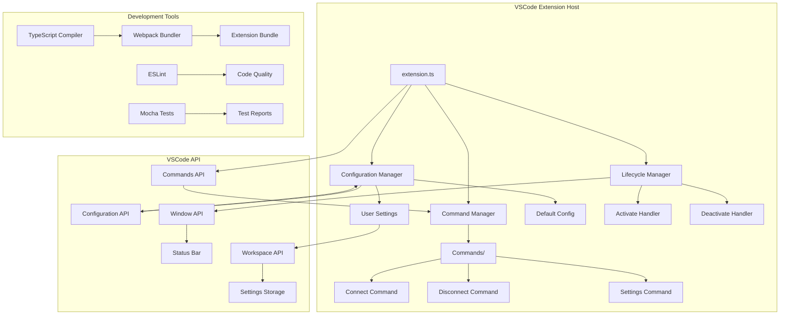
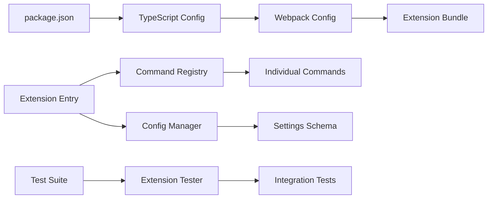
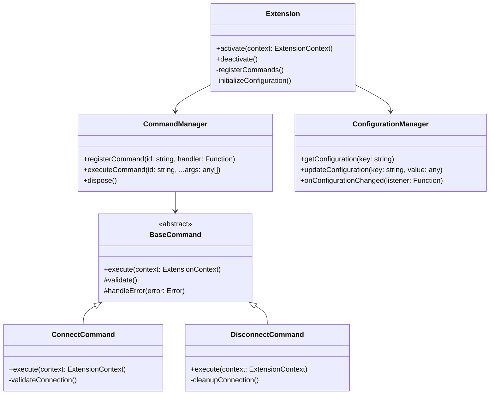

# VSCode Twitch Chatroom Extension - 架構設計

## 系統架構圖



## 模組依賴關係



## 檔案結構規劃

```
vscode-twitch-chatroom/
├── src/
│   ├── extension.ts                 # 主要入口點
│   ├── commands/
│   │   ├── index.ts                # 命令匯出
│   │   ├── connect.ts              # 連線命令
│   │   ├── disconnect.ts           # 斷線命令
│   │   └── settings.ts             # 設定命令
│   ├── config/
│   │   ├── constants.ts            # 常數定義
│   │   └── defaults.ts             # 預設設定
│   ├── types/
│   │   └── extension.ts            # 類型定義
│   └── utils/
│       ├── logger.ts               # 日誌工具
│       └── validation.ts           # 驗證工具
├── test/
│   ├── suite/
│   │   ├── extension.test.ts       # 擴充套件測試
│   │   └── commands.test.ts        # 命令測試
│   └── runTest.ts                  # 測試執行器
├── docs/
│   ├── architecture.md             # 架構文件
│   └── development.md              # 開發指南
├── .vscode/
│   ├── launch.json                 # 除錯配置
│   ├── settings.json               # 工作區設定
│   └── tasks.json                  # 任務配置
├── package.json                    # 套件定義
├── tsconfig.json                   # TypeScript 配置
├── webpack.config.js               # 打包配置
├── .eslintrc.json                  # ESLint 規則
└── README.md                       # 專案說明
```

## 核心類別設計

