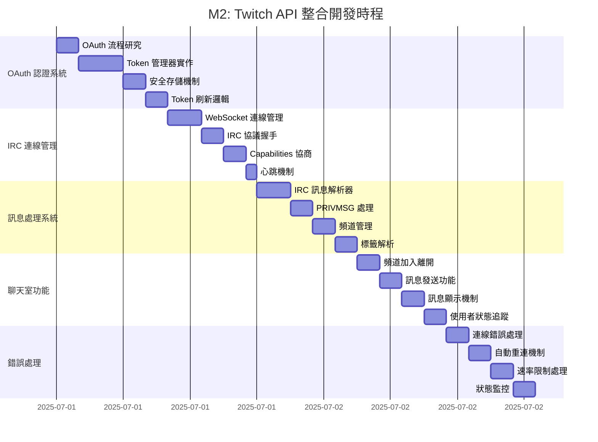
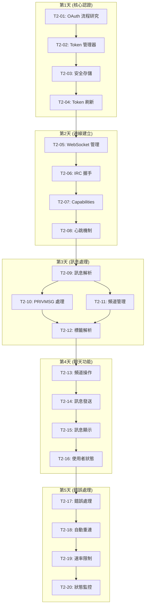
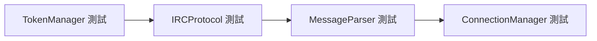

# M2 開發工作流程

## 開發階段與時程規劃



## 實作優先級與依賴關係



## 開發前置準備清單

### 必要的外部資源
- [ ] 註冊 Twitch 開發者帳號
- [ ] 建立 Twitch 應用程式 (獲取 Client ID/Secret)
- [ ] 設定 OAuth Redirect URI
- [ ] 準備測試用 Twitch 頻道

### 開發環境設定
- [ ] 安裝必要的 NPM 套件 (ws, node-fetch)
- [ ] 配置 TypeScript 類型定義
- [ ] 建立測試配置檔案
- [ ] 設定開發用的環境變數

### 程式碼結構準備
- [ ] 建立 `src/twitch/` 目錄結構
- [ ] 建立介面定義檔案
- [ ] 設定 ESLint 規則更新
- [ ] 準備單元測試框架

## 測試策略

### 單元測試


### 整合測試
- WebSocket 連線測試
- OAuth 流程端到端測試
- 實際 Twitch 頻道連線測試

### 測試環境配置
```typescript
// test-config.ts
export const TEST_CONFIG = {
  clientId: process.env.TWITCH_CLIENT_ID,
  clientSecret: process.env.TWITCH_CLIENT_SECRET,
  testChannel: process.env.TWITCH_TEST_CHANNEL,
  redirectUri: 'http://localhost:7777/auth/callback'
};
```

## 風險評估與緩解策略

### 高風險項目
1. **OAuth 複雜度**
   - 風險: 認證流程實作困難
   - 緩解: 先實作簡化版本，逐步完善

2. **WebSocket 穩定性**
   - 風險: 連線不穩定導致頻繁斷線
   - 緩解: 實作強健的重連機制

3. **Twitch API 限制**
   - 風險: 遇到未知的 API 限制
   - 緩解: 充分閱讀文件，實作保守的速率限制

### 中風險項目
1. **訊息解析正確性**
   - 風險: IRC 訊息格式解析錯誤
   - 緩解: 大量測試不同訊息格式

2. **記憶體使用效率**
   - 風險: 長時間執行記憶體洩漏
   - 緩解: 實作適當的清理機制

## 完成標準檢查清單

### 功能性需求
- [ ] 能夠通過 OAuth 認證 Twitch 帳號
- [ ] 能夠連接到指定的 Twitch 頻道
- [ ] 能夠接收並顯示聊天訊息
- [ ] 能夠發送訊息到聊天室
- [ ] 具備基本的錯誤處理

### 非功能性需求
- [ ] 連線穩定性 (自動重連)
- [ ] 效能表現 (低記憶體使用)
- [ ] 安全性 (Token 安全存儲)
- [ ] 可維護性 (清晰的程式碼結構)

### 品質檢查
- [ ] 通過所有單元測試
- [ ] 通過整合測試
- [ ] 代碼覆蓋率 > 80%
- [ ] 無 ESLint 錯誤
- [ ] 通過 TypeScript 嚴格檢查

## 交付物清單

### 程式碼模組
1. `AuthManager` - 認證管理
2. `IRCConnectionManager` - 連線管理
3. `MessageHandler` - 訊息處理
4. `TwitchConfig` - 配置管理

### 文件更新
1. API 文件
2. 使用者設定指南
3. 疑難排解指南
4. 開發者貢獻指南

### 測試套件
1. 單元測試
2. 整合測試
3. 端到端測試案例
4. 效能基準測試
