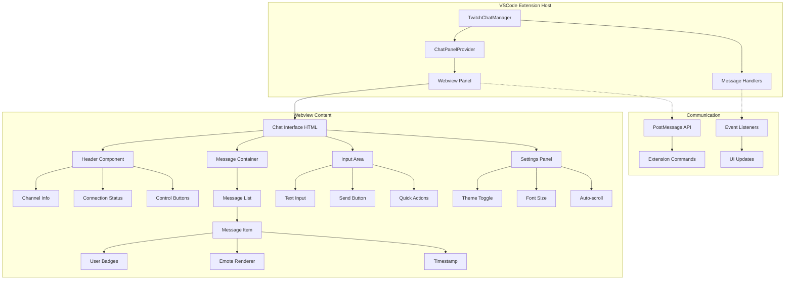
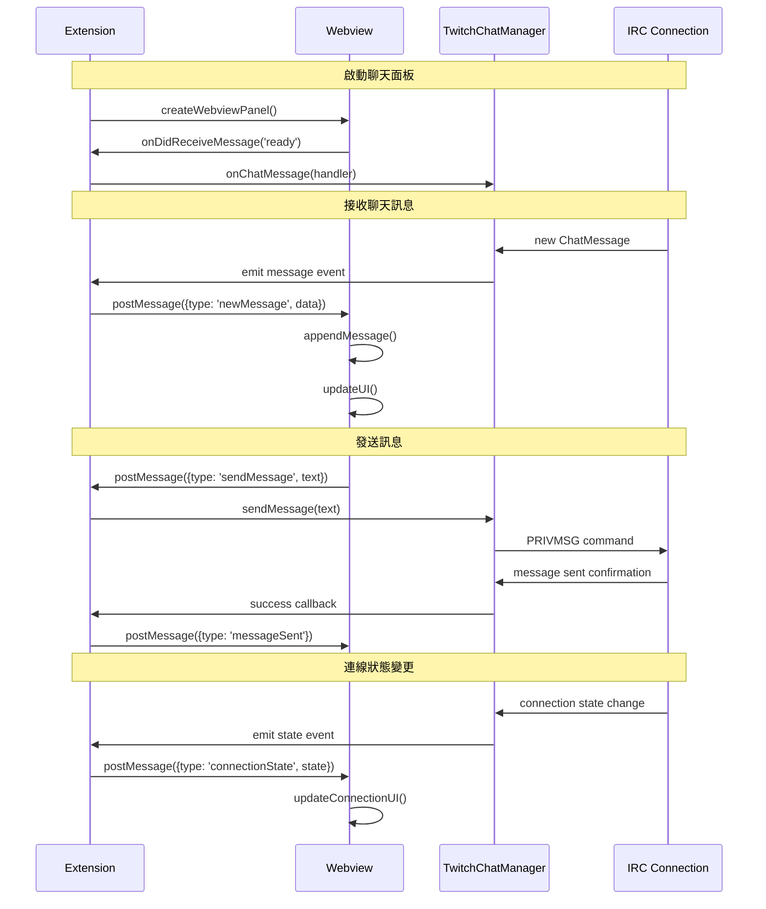

# M3 UI/UX 架構設計

## Webview 架構圖



## 組件互動流程



## UI 組件設計

### 主要布局結構

```html
<div class="chat-container">
  <!-- Header 區域 -->
  <header class="chat-header">
    <div class="channel-info">
      <span class="channel-name">#channelname</span>
      <span class="viewer-count">1,234 viewers</span>
    </div>
    <div class="connection-status">
      <span class="status-indicator connected"></span>
      <span class="status-text">Connected</span>
    </div>
    <div class="header-controls">
      <button class="btn-settings">⚙️</button>
      <button class="btn-disconnect">🔌</button>
    </div>
  </header>

  <!-- 訊息區域 -->
  <main class="messages-container">
    <div class="messages-list" id="messagesList">
      <!-- 動態生成的訊息項目 -->
    </div>
    <div class="scroll-indicator">
      <button class="btn-scroll-bottom">📍 Jump to bottom</button>
    </div>
  </main>

  <!-- 輸入區域 -->
  <footer class="input-area">
    <div class="input-container">
      <input type="text" class="message-input" placeholder="Type a message...">
      <button class="btn-send">Send</button>
    </div>
    <div class="quick-actions">
      <button class="btn-emote">😊</button>
      <button class="btn-clear">🗑️</button>
    </div>
  </footer>

  <!-- 設定面板 (可摺疊) -->
  <aside class="settings-panel hidden">
    <div class="settings-content">
      <h3>Chat Settings</h3>
      <!-- 設定選項 -->
    </div>
  </aside>
</div>
```

### 訊息項目組件

```html
<div class="message-item" data-user-type="moderator">
  <div class="message-timestamp">14:30</div>
  <div class="message-user">
    <div class="user-badges">
      <span class="badge moderator">MOD</span>
      <span class="badge subscriber">SUB</span>
    </div>
    <span class="user-name" style="color: #ff6b6b;">StreamerName</span>
  </div>
  <div class="message-content">
    <span class="message-text">Hello chat! 👋</span>
    <div class="message-emotes">
      <!-- 表情符號渲染 -->
    </div>
  </div>
</div>
```

## CSS 主題系統

### VSCode 主題變數整合

```css
:root {
  /* VSCode 主題變數 */
  --vscode-foreground: var(--vscode-foreground);
  --vscode-background: var(--vscode-editor-background);
  --vscode-panel-background: var(--vscode-panel-background);
  --vscode-border: var(--vscode-panel-border);
  
  /* 自定義聊天室變數 */
  --chat-header-bg: var(--vscode-titleBar-activeBackground);
  --chat-message-bg: var(--vscode-editor-background);
  --chat-input-bg: var(--vscode-input-background);
  --chat-accent: var(--vscode-focusBorder);
  
  /* 使用者類型顏色 */
  --user-broadcaster: #ff6b6b;
  --user-moderator: #4ecdc4;
  --user-vip: #ffd93d;
  --user-subscriber: #6bcf7f;
  --user-viewer: var(--vscode-foreground);
}

/* 深色主題特定樣式 */
[data-vscode-theme-kind="vscode-dark"] {
  --chat-shadow: rgba(0, 0, 0, 0.3);
  --chat-hover: rgba(255, 255, 255, 0.1);
}

/* 淺色主題特定樣式 */
[data-vscode-theme-kind="vscode-light"] {
  --chat-shadow: rgba(0, 0, 0, 0.1);
  --chat-hover: rgba(0, 0, 0, 0.05);
}
```

## 響應式設計

### 佈局適應性

```css
.chat-container {
  display: grid;
  grid-template-areas: 
    "header"
    "messages" 
    "input";
  grid-template-rows: auto 1fr auto;
  height: 100vh;
}

/* 寬螢幕佈局 */
@media (min-width: 800px) {
  .chat-container {
    grid-template-areas: 
      "header header"
      "messages settings"
      "input input";
    grid-template-columns: 1fr 300px;
  }
  
  .settings-panel {
    grid-area: settings;
  }
}

/* 窄螢幕佈局 */
@media (max-width: 400px) {
  .chat-header {
    flex-direction: column;
    gap: 8px;
  }
  
  .input-container {
    flex-direction: column;
  }
}
```

## 效能優化策略

### 虛擬滾動 (可選)
```javascript
class VirtualMessageList {
  constructor(container, itemHeight = 60) {
    this.container = container;
    this.itemHeight = itemHeight;
    this.visibleCount = Math.ceil(container.clientHeight / itemHeight) + 2;
    this.messages = [];
    this.scrollTop = 0;
  }
  
  render() {
    const startIndex = Math.floor(this.scrollTop / this.itemHeight);
    const endIndex = Math.min(startIndex + this.visibleCount, this.messages.length);
    
    // 只渲染可見範圍內的訊息
    this.renderVisibleMessages(startIndex, endIndex);
  }
}
```

### 訊息節流
```javascript
class MessageThrottle {
  constructor(maxMessages = 200) {
    this.maxMessages = maxMessages;
    this.messages = [];
  }
  
  addMessage(message) {
    this.messages.push(message);
    if (this.messages.length > this.maxMessages) {
      this.messages.shift(); // 移除最舊的訊息
    }
  }
}
```