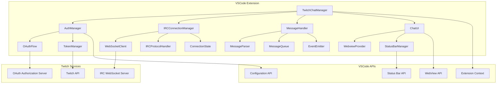
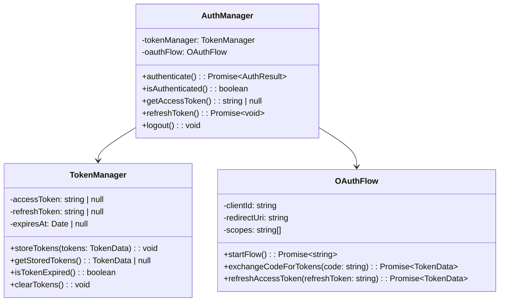
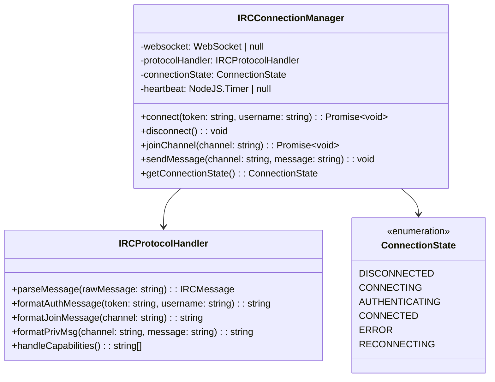
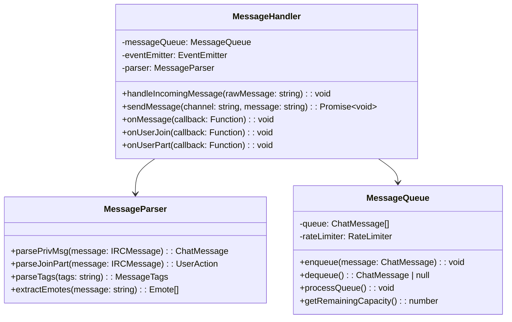
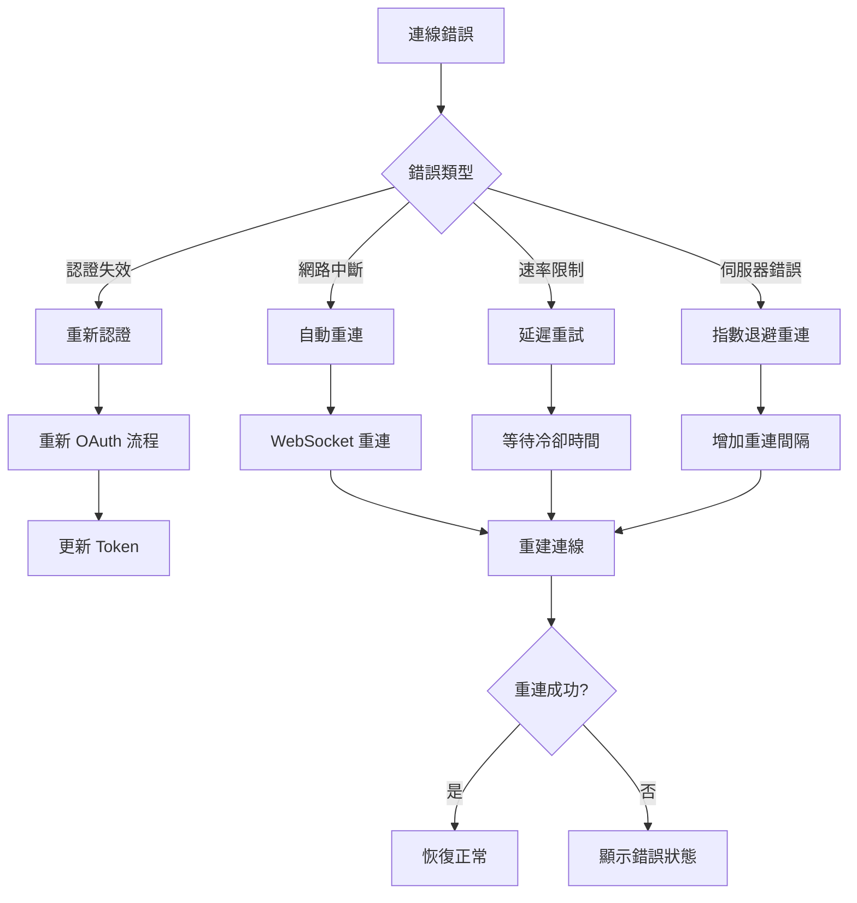

# Twitch 整合架構設計

## 系統架構圖



## 核心組件設計

### 1. AuthManager - 認證管理器



### 2. IRCConnectionManager - IRC 連線管理器



### 3. MessageHandler - 訊息處理器



## 資料結構定義

```typescript
interface TwitchConfig {
    clientId: string;
    redirectUri: string;
    scopes: string[];
    channel: string;
    username: string;
    autoConnect: boolean;
}

interface TokenData {
    accessToken: string;
    refreshToken: string;
    expiresIn: number;
    scope: string[];
    tokenType: string;
}

interface IRCMessage {
    prefix?: string;
    command: string;
    params: string[];
    tags?: Record<string, string>;
}

interface ChatMessage {
    id: string;
    channel: string;
    username: string;
    displayName: string;
    message: string;
    timestamp: Date;
    badges: Badge[];
    emotes: Emote[];
    color?: string;
    userType: UserType;
}

interface UserAction {
    type: 'join' | 'part';
    channel: string;
    username: string;
    timestamp: Date;
}

enum UserType {
    VIEWER = 'viewer',
    SUBSCRIBER = 'subscriber',
    MODERATOR = 'moderator',
    VIP = 'vip',
    BROADCASTER = 'broadcaster'
}
```

## 錯誤處理策略



## 安全性考量

### Token 安全存儲
- 使用 VSCode SecretStorage API
- Token 加密存儲
- 定期檢查 Token 有效性

### 速率限制處理
- 實作智能訊息佇列
- 監控 API 使用限制
- 預防性限流機制

### 用戶隱私
- 不記錄敏感訊息
- 可配置的資料保留策略
- 符合 Twitch 服務條款

## 效能優化

### 連線管理
- WebSocket 連線池
- 自動心跳維持
- 智能重連策略

### 訊息處理
- 非同步訊息處理
- 批次處理機制
- 記憶體使用優化